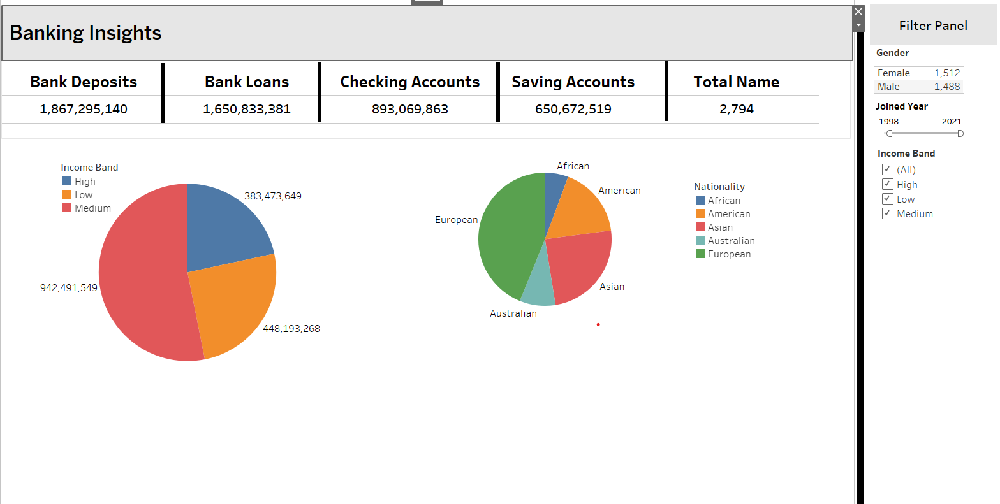

# Banking Insights Dashboard

This dashboard provides a comprehensive overview of key banking metrics and customer demographics. It is designed to help stakeholders quickly understand business performance and customer trends.

## Features

- **Key Metrics Overview**:
  - Bank Deposits
  - Bank Loans
  - Checking Accounts
  - Saving Accounts
  - Total Customers

- **Demographic Insights**:
  - Income Band Distribution (High, Medium, Low)
  - Customer Nationality Breakdown (African, American, Asian, Australian, European)

- **Filters**:
  - Gender (Male / Female)
  - Joined Year (1998 - 2021)
  - Income Band (High, Low, Medium)

## How to Use

1. **View Key Metrics**: Monitor the totals displayed at the top of the dashboard.
2. **Analyze Demographics**: Use the pie charts to understand the distribution of income bands and nationalities.
3. **Apply Filters**: Use the right-hand filter panel to refine data views by gender, year of joining, and income band.

## Screenshot

